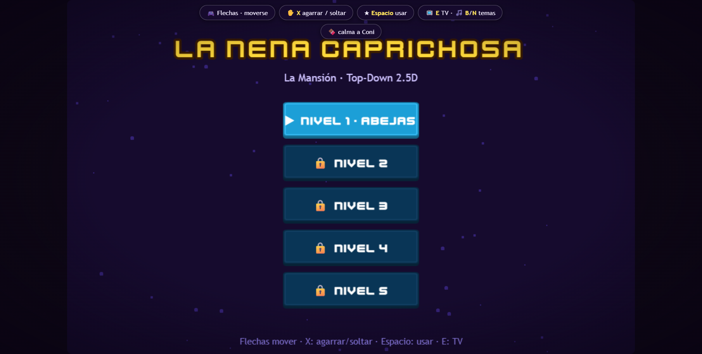
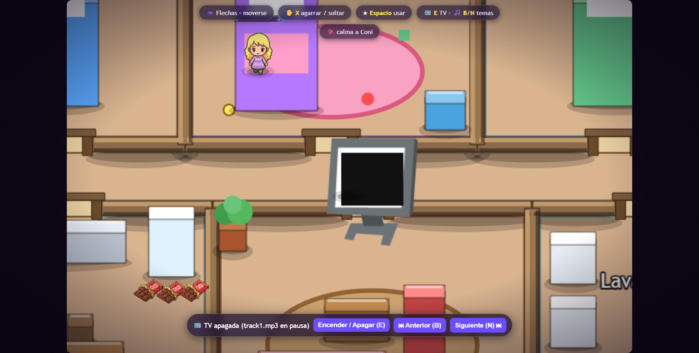

# Jazmín al Rescate: Caos en la Mansión

Juego HTML5 top-down 2.5D en **Phaser 3** (sin build, scripts clásicos).
Cuidá a Coni, resolvé catástrofes cotidianas y que no quede nada en pie.




## Jugar

Sin instalación ni build:

```bat
python -m http.server 8000
```

Abrir `http://localhost:8000` (recomendado: así cargan `assets/`).
Doble-clic a `index.html` también funciona (Phaser va por CDN: necesita internet).

## Controles

| Tecla | Acción |
|---|---|
| Flechas | Moverse (8 direcciones) |
| X | Agarrar / soltar / intercambiar objeto (1 en mano) |
| Espacio | Acción contextual (raquetazo, ventana, extintor, mopa, etc.) |
| E / B / N | TV on-off / canción anterior / siguiente |
| P | Pausa |

## Niveles

1. 🐝 **Abejas** — cerrá la ventana, matá abejas con la raqueta, calmá a Coni.
2. 🔥 **Cocina** — apagá la olla con el extintor y silenciá la alarma.
3. 💧 **Baño** — cerrá la canilla y secá charcos con la mopa (cuidado al resbalar).
4. 🔋 **Juguetes** — quitale las pilas a los 4 juguetes antes del berrinche.
5. 🏊 **Patio** — atrapá a Coni con el flotador y cerrá el ventanal.

Los niveles se desbloquean al completar el anterior (progreso en `localStorage`).

## Estructura

- `index.html` + `style.css` + `game.js` (MainScene + boot) + `js/` (módulos).
- `js/rules.js` lógica pura testeable · `js/systems/threat*.js` amenazas
  (una subclase por nivel) · `js/sdk.js` wrapper CrazyGames con guards.
- `HISTORIAL.txt` lista cada cambio por código (`F1-P3`, `G2`, `A4`...).
- `GDD_Jazmin_Al_Rescate.txt` diseño original · `PUBLICAR.md` cómo publicar.

## Créditos (CC0)

- Sprites de personajes: generados por IA para este proyecto.
- Pisos y objetos: imágenes CC0 adaptadas + fallbacks dibujados por código.
- UI: [Kenney UI Pack](https://kenney.nl) (botones, fuente Kenney Future).
- SFX: [Kenney Interface Sounds](https://kenney.nl) (13 efectos) + 4
  sintetizados por WebAudio. Juguetes N4 y TV: Kenney Generic Items.
- Música: pistas propias en `assets/music/`.

## Desarrollo

```bat
node --check game.js            :: sintaxis
python -m http.server 8000      :: servir local
```

Ver `AGENTS.md` (herramientas del proyecto) y `HISTORIAL.txt` (cambios).
